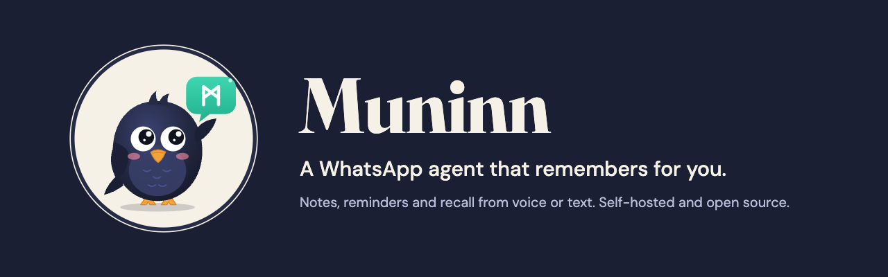

<p align="center">
  
</p>

> *In Norse myth, Odin had two ravens. Huginn was "thought". Muninn was "memory".
> Every day they flew around the world and came back to tell him what they had seen.*

**Muninn is a self-hosted AI assistant that lives in WhatsApp and remembers things for you.**

You talk to it like you'd talk to a person: type a message or just send a voice note.
It saves what you tell it, finds it again when you ask, and reminds you at the right time.
Everything is stored on **your own server**, encrypted.

> **Status: early design phase.** There's no working code yet. We're writing down
> what we're building and why before we build it. See [Roadmap](#roadmap) and
> [`docs/architecture_decisions/`](docs/architecture_decisions/).

---

## Why this exists


Most "second brain" apps are built for people who already live in apps. They need
another login, another interface, another thing to learn.

But almost everyone already uses WhatsApp, including our parents and grandparents.
Many of them would rather hold the mic button and talk than type.

Muninn was built with one user in mind: **a dad** who wants to say
*"I parked on floor 3"* into his phone and, two hours later, ask *"where did I park?"*
and get an answer. No new app, no typing, and his data stored on his own server.

## What it does

| | Example |
|---|---|
| **Remembers things for you** | *"I parked on floor 3"* · *"I lent Guy 200 shekels"* |
| **Finds them when you ask** | *"Where did I put the passport?"* · *"How much does Guy owe me?"* |
| **Reminds you on time** | *"Remind me on Tuesday at 10 to call the doctor"* |
| **Understands voice notes** | Speech-to-text in **Hebrew** and **Russian** (and English), because many people prefer talking to typing |
| **Keeps your data yours** | Runs on your own server. Data is encrypted at rest. No third-party database. Use a local model and nothing leaves your server at all. |

### An example conversation

```
You:     (voice note) "I put the passport in the top drawer of the desk"
Muninn:  Got it, passport → top drawer of the desk.

... three weeks later ...

You:     where's my passport?
Muninn:  You told me on Sept 3 that you put it in the top drawer of the desk.

You:     remind me Tuesday at 10 to call the doctor
Muninn:  Okay, I'll remind you Tuesday, Sept 29 at 10:00.

... Tuesday, 10:00 ...

Muninn:  Reminder: call the doctor.
```

## Design principles

1. **Voice first.** A voice note is a normal input, not an edge case. If speech-to-text
   doesn't work well in Hebrew and Russian, the product doesn't work.
2. **Zero learning curve.** No commands, no menus, no special syntax. Just talk.
3. **Your server, your data.** Self-hosted by design. Encrypted at rest. Easy to
   export and easy to delete. Be aware: with a hosted LLM (OpenAI, Claude), the text of
   each conversation is sent to that provider to be processed. With a local model
   (Ollama, vLLM), nothing leaves your server. See [ADR 0007](docs/architecture_decisions/0007-llm-providers.md).
4. **Boring to run.** One `docker compose up` on a small VPS or a home machine should
   be enough. No Kubernetes, no pile of managed services.
5. **Honest about what it knows.** If it doesn't remember something, it says so.
   It doesn't make things up.

## How it will work (high level)

```
 WhatsApp ──► Webhook ──► Muninn server (your machine)
                            │
                            ├── Voice note? ──► Speech-to-text (Hebrew / Russian / English)
                            │
                            ├── AI agent decides: save a memory / answer a question / set a reminder
                            │
                            ├── Encrypted storage (memories, reminders)
                            │
                            └── Scheduler ──► sends the reminder back on WhatsApp at the right time
```

**Stack:** Python (FastAPI) backend in four layers (api / services / domain / adapters),
React + TypeScript + Tailwind dashboard organized by feature, Docker Compose to run it.

- [Backend architecture](docs/architecture/backend.md)
- [Agent architecture](docs/architecture/agent.md)
- [Dashboard architecture](docs/architecture/dashboard.md)
- [Architecture Decision Records](docs/architecture_decisions/): what we decided and why.
  Still open: WhatsApp integration, speech-to-text engine, storage and encryption.
  If you have an opinion, open an issue.

## Repository layout

```
muninn/
├── apps/
│   ├── backend/            # Python + FastAPI, four layers
│   └── dashboard/          # React + TypeScript + Tailwind, organized by feature
├── docs/
│   ├── architecture/       # how the system looks now
│   ├── architecture_decisions/   # ADRs: what we decided and why
│   └── assets/             # images for the README and docs
├── scripts/                # repo-wide helper scripts (setup, backups, codegen)
├── docker-compose.yml      # STAGE / PROD
├── docker-compose.dev.yml  # DEV override (hot reload)
├── Makefile                # make dev-up, make dev-down, ... (run `make` for all)
├── AGENTS.md               # how to work in this codebase (contributors and AI assistants)
└── .env.example            # copy to .env
```

## Roadmap

- [ ] **Phase 0: Design.** README, stack, backend and dashboard architecture, open ADRs for WhatsApp / STT / storage *(we are here)*
- [ ] **Phase 1: Text MVP.** Receive WhatsApp text, save memories, answer questions
- [ ] **Phase 2: Voice.** Hebrew and Russian voice notes via speech-to-text
- [ ] **Phase 3: Reminders.** Natural-language scheduling, timezone-aware delivery
- [ ] **Phase 4: Security.** Encryption at rest, key management, export and delete-all
- [ ] **Phase 5: Self-hosting.** Docker Compose, setup guide, small-VPS deployment
- [ ] **Later:** Web dashboard to browse and edit memories, multiple family members

## Getting started

There's no application code yet, so there's nothing to run. The setup will look like this:

```bash
make env        # creates .env from .env.example, then set APP_ENV=DEV | STAGE | PROD

make dev-up     # DEV: hot reload. Backend on :8000 (/docs), dashboard on :5173
make dev-logs   # follow the logs
make dev-down   # stop

make prod-up    # STAGE / PROD: production build, app on :80
```

Run `make` to see every command.

Star or watch the repo to follow along.

## Contributing

Contributions are welcome, especially right now while the design is still open.
Read [CONTRIBUTING.md](CONTRIBUTING.md) to get started.

Particularly useful right now:
- Experience with **Hebrew or Russian speech-to-text** (Whisper, ivrit.ai, etc.)
- Experience with the **WhatsApp Cloud API** or self-hosted WhatsApp bridges
- Feedback on the architecture docs and ADRs in [`docs/architecture_decisions/`](docs/architecture_decisions/)

## Security

Muninn is built to store personal information, so security matters a lot here.
Please **do not** report vulnerabilities in public issues. See [SECURITY.md](SECURITY.md).

## License

[MIT](LICENSE) © Daniel Popov
